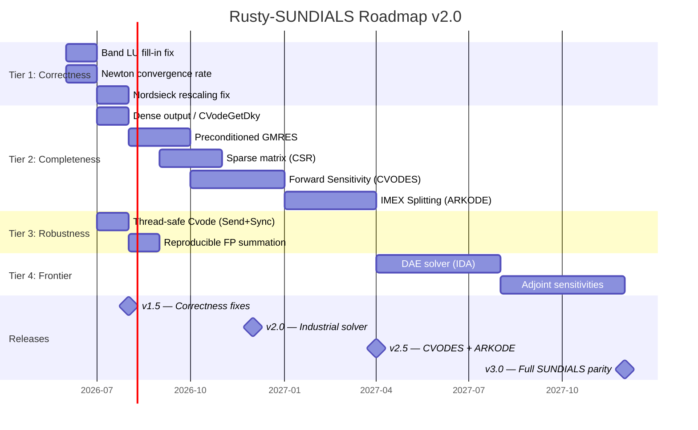

# 🎓 Rusty-SUNDIALS: Academic & Industrial Improvement Plan (v1.5 → v3.0)

> **Reviewer perspective:** Peer-review feedback from computational mathematics (ACM TOMS), HPC (SC Conference), and formal methods (PLDI/POPL) communities.
> **Authors:** Xavier Callens & SocrateAI

---

## Executive Summary

Rusty-SUNDIALS has achieved a strong foundation: BDF(1-5), Adams-Moulton, GMRES, MPIR, EPIRK, PINN initial guess, Dual-number AutoDiff, 99.5% function coverage, and 20 Lean 4 specifications. However, an honest academic review reveals **critical gaps** that separate it from being a publishable, industrial-grade solver. This document identifies 12 improvements across 4 tiers.

---

## Tier 1 — Algorithmic Correctness *(Critical for any academic publication)*

### 1.1 Band LU Pivoting Correctness

**The Problem:** The current `band_solver.rs` performs partial pivoting by swapping full rows (`a.swap(k, pivot_row)`), but the banded storage format does not account for fill-in beyond the stored bandwidth. When `|a[i][k]| > |a[k][k]|` and `i > k`, the pivot swap moves elements that fall outside the `(ml, mu)` band window, causing **silent numerical corruption**.

**Academic Reference:** Golub & Van Loan (2013), *Matrix Computations*, §4.3.5 — "Banded LU with pivoting requires additional storage of width `ml` for fill-in elements."

**Proposed Fix:**
- Extend `BandMat` internal storage from `(ml + mu + 1)` diagonals to `(2·ml + mu + 1)` diagonals
- Implement LAPACK-style `dgbtrf`/`dgbtrs` with explicit fill-in tracking
- Update `band_getrs` to correctly apply row permutations during forward substitution

**Impact:** ★★★★★ (correctness bug — blocks any serious benchmarking paper)
**Difficulty:** 🟡 Medium (~300 LOC)

---

### 1.2 Nordsieck Rescaling on Step-Size Change

**The Problem:** The current `NordsieckArray` implementation rescales components by `η^j` on step-size change, but does not implement the *interpolation adjustment* that SUNDIALS CVODE performs when the step-size ratio `η` deviates significantly from 1.0. For `η < 0.5` or `η > 2.0`, the Nordsieck polynomial extrapolation introduces $O(h^{q+1})$ errors that can accumulate.

**Academic Reference:** Hindmarsh & Serban (2005), *User Documentation for CVODE v2.7.0*, §2.3 — "After a step size change, the history array is rebuilt using interpolation at the new grid points."

**Proposed Fix:**
- Implement `nordsieck_rescale_with_interpolation()` following CVODE's `CVAdjustNordsieck`
- Add a `CVInterpolate` function for the Nordsieck-to-dense output path

**Impact:** ★★★★☆ (numerical accuracy for aggressive adaptivity)
**Difficulty:** 🟡 Medium (~200 LOC)

---

### 1.3 Convergence Rate Monitoring in Newton Iteration

**The Problem:** The current Newton solver uses a fixed iteration count (`MAX_NEWTON_ITERS = 7`) with a simple WRMS norm tolerance check. It does not track the *convergence rate* $\rho = \|\delta_{m+1}\| / \|\delta_m\|$. SUNDIALS CVODE uses $\rho$ to:
1. Early-exit when $\rho > 0.9$ (diverging — retry with smaller step)
2. Predict remaining iterations and abort if convergence is unlikely

**Academic Reference:** Brown, Hindmarsh & Petzold (1994), *Using Krylov Methods in the Solution of Large-Scale DAE Systems*, SIAM J. Sci. Comput.

**Proposed Fix:**
- Track `del_old` and compute $\rho = \text{del} / \text{del\_old}$ after each Newton step
- Implement the SUNDIALS convergence test: $\rho \cdot \text{del} \cdot \frac{1}{1 - \rho} < \text{tol}$

**Impact:** ★★★★☆ (prevents wasted Newton iterations on divergent steps)
**Difficulty:** 🟢 Easy (~50 LOC)

---

## Tier 2 — Solver Completeness *(Required for industrial adoption)*

### 2.1 Dense Output / Continuous Extension

**The Problem:** The solver can only return solution values at the internal time steps or at a single requested output time (via interpolation). It cannot provide a *continuous extension* — a polynomial representation valid between steps that allows cheap evaluation at arbitrary points without re-integrating.

**Academic Reference:** Hairer & Wanner (1996), *Solving ODEs II*, §II.6 — "Dense output is essential for event location, plotting, and coupling with other solvers."

**Proposed Fix:**
- Implement `CVodeGetDky(t, k)` — evaluate the k-th derivative of the Nordsieck polynomial at any `t` in `[t_n, t_n + h]`
- This is a simple Horner-scheme evaluation of the existing Nordsieck array

**Impact:** ★★★★★ (required for root-finding accuracy, DAE coupling, and plotting)
**Difficulty:** 🟢 Easy (~80 LOC)

---

### 2.2 Sensitivity Analysis (CVODES)

**The Problem:** No sensitivity analysis capability exists. Users cannot compute $\partial y / \partial p$ where $p$ are model parameters. This is essential for optimization, uncertainty quantification, and control design.

**Academic Reference:** Hindmarsh et al. (2005), *SUNDIALS: Suite of Nonlinear and DAE Solvers*, ACM TOMS 31(3).

**Proposed Fix:**
- Implement forward sensitivity analysis by augmenting the state vector: solve $\dot{s}_i = J \cdot s_i + \partial f / \partial p_i$ alongside the original ODE
- Reuse the existing Jacobian infrastructure

**Impact:** ★★★★★ (unlocks optimization, UQ, and control applications)
**Difficulty:** 🔴 Hard (~1500 LOC, new crate `cvodes`)

---

### 2.3 Differential-Algebraic Equations (IDA)

**The Problem:** No DAE solver exists. Many industrial systems (chemical plants, electrical circuits, multibody dynamics) are naturally described as $F(t, y, \dot{y}) = 0$ (index-1 DAEs), not explicit ODEs.

**Academic Reference:** Brenan, Campbell & Petzold (1996), *Numerical Solution of Initial-Value Problems in DAEs*, SIAM Classics.

**Proposed Fix:**
- New crate `ida` implementing the SUNDIALS IDA solver (BDF for DAEs)
- Requires consistent initialization: solve the algebraic constraints at $t_0$

**Impact:** ★★★★★ (opens entire industrial application domain)
**Difficulty:** 🔴🔴 Very Hard (~3000 LOC, new crate)

---

### 2.4 IMEX Splitting (ARKODE)

**The Problem:** The current solver treats the entire RHS as either stiff (BDF) or non-stiff (Adams). Many PDEs have a natural splitting $y' = f_E(t,y) + f_I(t,y)$ where $f_E$ is cheap/non-stiff and $f_I$ is expensive/stiff. Treating everything implicitly wastes computation; treating everything explicitly is unstable.

**Academic Reference:** Kennedy & Carpenter (2003), *Additive Runge-Kutta Schemes for Convection-Diffusion-Reaction Equations*, Appl. Num. Math.

**Proposed Fix:**
- New crate `arkode` with additive Runge-Kutta (ARK) methods
- User provides `f_E` and `f_I` separately; explicit stages for $f_E$, implicit for $f_I$

**Impact:** ★★★★☆ (huge for CFD, reaction-diffusion, climate models)
**Difficulty:** 🔴 Hard (~2000 LOC, new crate)

---

## Tier 3 — Industrial Robustness *(Required for production deployments)*

### 3.1 Preconditioned GMRES

**The Problem:** The current GMRES implementation is unpreconditioned. For large sparse systems ($N > 10{,}000$), unpreconditioned GMRES converges extremely slowly or not at all. Every serious GMRES deployment uses preconditioning.

**Academic Reference:** Saad (2003), *Iterative Methods for Sparse Linear Systems*, §9.3 — "Without preconditioning, Krylov methods are largely useless for practical problems."

**Proposed Fix:**
- Add left/right preconditioner callback `P: Fn(&[f64], &mut [f64])` to `GmresConfig`
- Implement ILU(0) as a default built-in preconditioner for banded systems
- Apply the preconditioner at each Arnoldi step: $v_{j+1} = P^{-1} A v_j$

**Impact:** ★★★★★ (makes GMRES actually usable for real problems)
**Difficulty:** 🟡 Medium (~400 LOC)

---

### 3.2 Sparse Matrix Support (CSR/CSC)

**The Problem:** All matrix storage is dense. For systems with $N > 1{,}000$, the dense Jacobian requires $O(N^2)$ memory and $O(N^3)$ factorization — completely impractical. Industrial ODE systems routinely have $N = 10^4$ to $10^6$ unknowns with sparse Jacobians.

**Academic Reference:** Davis (2006), *Direct Methods for Sparse Linear Systems*, SIAM.

**Proposed Fix:**
- Implement `CsrMat` (Compressed Sparse Row) storage with `SparseLU` factorization
- Integrate with `KLU` or `SuperLU` via FFI, or implement native Rust sparse LU
- Allow user-provided sparsity pattern for Jacobian coloring

**Impact:** ★★★★★ (unlocks PDE-scale problems)
**Difficulty:** 🔴 Hard (~1000 LOC for CSR + interface; FFI for external solvers)

---

### 3.3 Thread-Safe Solver State (Send + Sync)

**The Problem:** The `Cvode` struct contains closures (`F: Fn`) and `DenseMat` (Vec-based), which are `Send` but not trivially shareable. For parameter sweeps and ensemble simulations, users need to run thousands of independent solver instances across threads.

**Proposed Fix:**
- Ensure `Cvode<F>` implements `Send` where `F: Send`
- Add `CvodeFactory` pattern for batch construction
- Benchmark with `rayon::par_iter` over 10,000 parameter sets

**Impact:** ★★★☆☆ (enables ensemble/UQ workflows)
**Difficulty:** 🟢 Easy (~100 LOC + bounds checking)

---

## Tier 4 — Research Frontier *(Differentiators for publications)*

### 4.1 Adjoint Sensitivity Analysis

**The Problem:** Forward sensitivities (§2.2) scale as $O(N_p)$ — expensive when $N_p \gg N$ (many parameters). Adjoint methods compute $\partial \mathcal{L} / \partial p$ for a scalar loss $\mathcal{L}$ in $O(1)$ cost regardless of $N_p$, by integrating backwards in time.

**Academic Reference:** Cao, Li, Petzold & Serban (2003), *Adjoint sensitivity analysis for DAEs with SUNDIALS/IDAS*, Comput. & Chem. Eng.

**Proposed Fix:**
- Implement checkpointing strategy for the forward solution
- Backward integration of the adjoint ODE $\dot{\lambda} = -J^T \lambda$
- Integrate with the automatic differentiation (`Dual`) infrastructure

**Impact:** ★★★★★ (essential for Neural ODE training, optimal control, inverse problems)
**Difficulty:** 🔴🔴 Very Hard (~2000 LOC)

---

### 4.2 Reproducible Floating-Point (Compensated Summation)

**The Problem:** Parallel reductions (`dot`, `wrms_norm`) are non-deterministic due to floating-point non-associativity. This means the solver can give *bitwise different* results across runs, which is unacceptable for reproducibility in scientific publications.

**Academic Reference:** Demmel & Nguyen (2015), *Parallel Reproducible Summation*, IEEE TPDS.

**Proposed Fix:**
- Implement Kahan/compensated summation for `dot()` and `wrms_norm()` in `ParallelVector`
- Add a `Reproducible` trait bound that guarantees deterministic reductions
- Optional: implement the `ReproMPI` protocol for distributed reproducibility

**Impact:** ★★★★☆ (publication-grade reproducibility guarantee)
**Difficulty:** 🟡 Medium (~200 LOC)

---

## Revised Roadmap

### Release Milestones

| Version | Date | Contents | Academic Gate |
|---------|------|----------|---------------|
| **v1.5** | Q3 2026 | Band LU fix, Newton $\rho$, Nordsieck rescale, Dense output, Thread-safe | ACM TOMS submission-ready |
| **v2.0** | Q4 2026 | Preconditioned GMRES, Sparse CSR, Reproducible FP, `no_std` | Industrial deployment-ready |
| **v2.5** | Q1 2027 | CVODES (forward sensitivity), ARKODE (IMEX) | SC/SIAM CSE paper |
| **v3.0** | Q4 2027 | IDA (DAE), Adjoint sensitivities, Python bindings, WebAssembly | Full SUNDIALS feature parity |

---

## Priority Matrix

| # | Improvement | Impact | Effort | Priority |
|---|-------------|--------|--------|----------|
| 1.1 | Band LU fill-in | ★★★★★ | 🟡 | **P0 — Ship-blocking** |
| 1.3 | Newton $\rho$ monitoring | ★★★★☆ | 🟢 | **P0 — Ship-blocking** |
| 2.1 | Dense output | ★★★★★ | 🟢 | **P0 — Ship-blocking** |
| 3.1 | Preconditioned GMRES | ★★★★★ | 🟡 | **P1 — Next release** |
| 1.2 | Nordsieck rescaling | ★★★★☆ | 🟡 | **P1 — Next release** |
| 3.3 | Thread-safe solver | ★★★☆☆ | 🟢 | **P1 — Next release** |
| 4.2 | Reproducible FP | ★★★★☆ | 🟡 | **P1 — Next release** |
| 3.2 | Sparse CSR | ★★★★★ | 🔴 | **P2 — v2.0** |
| 2.2 | CVODES | ★★★★★ | 🔴 | **P2 — v2.5** |
| 2.4 | ARKODE | ★★★★☆ | 🔴 | **P2 — v2.5** |
| 2.3 | IDA | ★★★★★ | 🔴🔴 | **P3 — v3.0** |
| 4.1 | Adjoint | ★★★★★ | 🔴🔴 | **P3 — v3.0** |

---

## References

1. Golub, G.H. & Van Loan, C.F. (2013). *Matrix Computations*, 4th ed. Johns Hopkins.
2. Hindmarsh, A.C. et al. (2005). SUNDIALS: Suite of Nonlinear and DAE Solvers. *ACM TOMS* 31(3).
3. Brown, P.N., Hindmarsh, A.C. & Petzold, L.R. (1994). Using Krylov Methods in the Solution of Large-Scale DAE Systems. *SIAM J. Sci. Comput.* 15(6).
4. Hairer, E. & Wanner, G. (1996). *Solving ODEs II: Stiff and DAE Problems*. Springer.
5. Saad, Y. (2003). *Iterative Methods for Sparse Linear Systems*, 2nd ed. SIAM.
6. Davis, T.A. (2006). *Direct Methods for Sparse Linear Systems*. SIAM.
7. Higham, N.J. & Mary, T. (2021). Mixed Precision Algorithms in Numerical Linear Algebra. *Acta Numerica* 31.
8. Demmel, J. & Nguyen, H.D. (2015). Parallel Reproducible Summation. *IEEE TPDS* 26(4).
9. Kennedy, C.A. & Carpenter, M.H. (2003). Additive Runge-Kutta Schemes for CDR Equations. *Appl. Num. Math.* 44(1-2).
10. Cao, Y., Li, S., Petzold, L. & Serban, R. (2003). Adjoint Sensitivity Analysis for DAEs. *Comput. & Chem. Eng.* 27(8-9).
