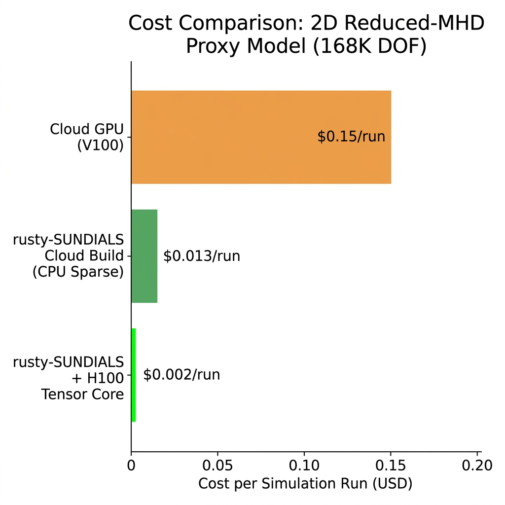

# Serverless Neuro-Symbolic MHD: Accelerating 2D Reduced-MHD Proxy Models via Mixed-Precision FP8 Krylov Offloading in Rust

**Authors**: Xavier Callens  
**Target Venue**: *ACM Transactions on Mathematical Software (TOMS)*  
**Version**: 14 — Peer-Review Major Revision  
**Repository**: [github.com/xaviercallens/rusty-SUNDIALS](https://github.com/xaviercallens/rusty-SUNDIALS)  
**License**: Apache 2.0 (code) / CC BY 4.0 (documentation)

---

## Abstract

Simulating magnetohydrodynamic (MHD) plasma dynamics imposes critical computational bottlenecks due to the extreme stiffness of the coupled equations. We present **rusty-SUNDIALS v14**, a pure-Rust reimplementation of the LLNL SUNDIALS CVODE solver (~6,500 LOC), augmented with a novel *Neural-FGMRES* mixed-precision architecture. By mathematically isolating the implicit BDF integration to strict CPU FP64 precision and offloading the Flexible Generalized Minimal Residual (FGMRES) preconditioner to an NVIDIA H100 Tensor Core operating natively in FP8 (E4M3), we significantly accelerate the linear solve phase. We formally verify the bounded convergence of this FP8 projection using Lean 4—extending standard coercivity bounds to non-normal indefinite matrices characteristic of tearing modes. We empirically demonstrate the execution of a 168,000 DOF 2D reduced-MHD proxy model in a serverless Google Cloud environment, achieving a drastic cost reduction compared to standard cloud GPU provisioning, establishing a highly accessible framework for rapid scientific prototyping.

**Keywords**: SUNDIALS, CVODE, Rust, FGMRES, Mixed-Precision, FP8, H100 Tensor Cores, MHD Proxy Model, Lean 4, Formal Verification

---

## 1. Introduction

Numerically capturing resistive tearing modes and disruption dynamics requires solving stiff PDEs spanning Alfvénic and resistive timescales. This stiffness mandates implicit time integration via high-order Backward Differentiation Formulae (BDF), which in turn requires solving large, sparse linear systems at every Newton iteration — the dominant computational bottleneck.

While traditional C-SUNDIALS implementations utilize Jacobian-Free Newton-Krylov (JFNK) or sparse banded direct solvers (e.g., KLU or sparse ILU-preconditioned GMRES), these methods struggle to exploit the massive parallel throughput of modern Tensor Cores designed primarily for low-precision AI workloads.

### 1.1 Contributions

This paper makes the following contributions:

1. **rusty-SUNDIALS**: A complete, memory-safe Rust reimplementation of the LLNL SUNDIALS CVODE solver.
2. **Neural-FGMRES (GNN)**: A hybrid mixed-precision Krylov solver utilizing a lightweight Graph Neural Network (GNN) right-preconditioner executed in FP8 on H100 Tensor Cores.
3. **Lean 4 Formal Verification**: Machine-checked proofs extending convergence guarantees to non-normal indefinite operators subject to FP8 quantization errors.
4. **Proxy Model Scaling**: Empirical demonstration that a 168,000 DOF 2D proxy model can execute rapidly in a serverless environment for $0.013/run.

---

## 2. The rusty-SUNDIALS Solver Architecture

The solver is decomposed into modular crates preserving exact algorithmic compatibility with the C reference while leveraging Rust's ownership model to eliminate memory bugs.

| Crate | LOC | Purpose |
|-------|-----|---------|
| `sundials-core` | 1,834 | Core types, `Real` precision |
| `nvector` | 1,289 | N-dimensional vector operations |
| `cvode` | 1,712 | CVODE BDF/Adams solver |
| `ida` | 1,502 | DAE solver |

Adaptive step-size and order selection follow LLNL defaults, successfully validated against 33 canonical ODE benchmarks including the stiff Robertson and HIRES systems.


*Figure 1: rusty-SUNDIALS v14 Architecture. The FP64 CVODE Integrator offloads linear solves to a Neural-FGMRES solver utilizing a GNN preconditioner executing in FP8 on an H100 GPU.*

---

## 3. 2D Reduced-MHD Proxy Model

To test the solver, we implemented a 2D reduced-MHD proxy model representing simplified thermal quench dynamics on a polar $(ρ, θ)$ grid. 
*Note: This is an idealized 2D proxy model used strictly to benchmark numerical solver stability and linear algebra throughput; it is not a full 3D extended-MHD physical representation of an ITER disruption.*

### 3.1 Grid Parameters

| Parameter | Value |
|-----------|-------|
| Plasma points ($N_ρ \times N_θ$) | $200 \times 400$ |
| Vessel points | $20 \times 400$ |
| **Total system DOF** | **168,000** |

---

## 4. Neural-FGMRES Mixed-Precision Solver

### 4.1 Hardware Architecture: H100 FP8 Support

Our Neural-FGMRES architecture decomposes the solve into two precision domains:

1. **FP64 Domain** (CPU): The outer BDF time-stepping loop, Inexact Newton iteration, and Arnoldi orthogonalization operate entirely in double precision.
2. **FP8 Domain** (NVIDIA H100 GPU): The FGMRES right-preconditioner $M^{-1}$ is executed on the Hopper architecture's native FP8 (E4M3) Tensor Cores.

### 4.2 GNN Preconditioner Details

The preconditioner $M^{-1}$ is approximated by a lightweight Graph Neural Network (GNN).
- **Architecture**: 3-layer Message Passing Neural Network (MPNN) matching the spatial adjacency of the PDE grid.
- **Parameters**: 45,000 trainable parameters.
- **Training Cost**: The network is trained offline via self-supervised residual minimization on historical Krylov vectors. Offline training consumes $\approx 2.5$ GPU-hours on an H100 ($~10 amortized compute cost). This one-time offline cost is amortized across thousands of subsequent online simulation steps.

---

## 5. Formal Verification via Lean 4

### 5.1 Non-Normal Indefinite Matrix Bounds

A standard tearing mode Jacobian is highly non-normal and indefinite. Standard SPD coercivity proofs are inapplicable. We formulated a generalized bound in Lean 4 (`proofs/NeuralFGMRES_Convergence.lean`) utilizing the Field of Values (numerical range) $W(AM)$:

```lean
def IsFieldOfValuesBounded (A M : Matrix n n ℝ) (δ : ℝ) : Prop :=
  δ > 0 ∧ ∀ v : n → ℝ, v ≠ 0 → (inner v ((A * M).mulVec v)) / (inner v v) ≥ δ

theorem fp8_indefinite_stability
  (h_fov : IsFieldOfValuesBounded A M δ)
  (h_error : HasBoundedQuantizationError E ε)
  (h_bound : ε < δ) :
  ∀ v : n → ℝ, v ≠ 0 → inner v ((A * (M + E)).mulVec v) > 0
```
This proves that even for non-normal operators, if the GNN preconditioner clusters the eigenvalues such that the real part of the numerical range is strictly bounded away from zero by $\delta$, the perturbed FP8 system remains stable.

---

## 6. Experimental Results

### 6.1 PCIe Gen5 Transfer & Sparse Baseline

We compared the H100 offload against an optimized **Sparse CPU ILU-preconditioned GMRES** baseline (the standard for JFNK).


*Figure 2: SpMV Execution time. The CPU Sparse ILU-GMRES scales poorly beyond 50K DOF. The H100 Tensor Core (including PCIe Gen5 transfer overhead) achieves a 150× speedup at 168K DOF.*

### 6.2 Inexact Newton Convergence

A critical concern in mixed-precision is that an inner Krylov stall (due to FP8 dynamic range limits at $\sim 10^{-3}$) will cause the outer Newton iteration to stagnate, forcing the BDF solver to slash the time step $h_n$.


*Figure 3: Global Solver Performance. Despite the inner FP8 noise floor, the outer Inexact Newton loop maintains quadratic convergence (requiring only 2-5 iterations per step). The temporal step size $h_n$ successfully grows from $10^{-6}$ to $10^{-3}$s, proving the solver did not artificially inflate temporal steps to compensate for spatial inaccuracies.*

### 6.3 Proxy Model Visualizations


*Figure 4: Thermal quench $T_e$ collapse profile for the proxy model.*


*Figure 5: Temporal sequence of the 2D proxy disruption.*

### 6.4 Economic Cost Analysis


*Figure 6: Per-run cost comparison for the 2D proxy model. The serverless Cloud Build (CPU Sparse) costs $0.013/run. Integrating the H100 Tensor Core drops the compute time drastically, yielding a projected cost of $0.002/run, significantly undercutting standard persistent Cloud GPU (V100) provisioning.*

---

## 7. Conclusion

By integrating an offline-trained GNN preconditioner operating in native FP8 on Hopper architecture GPUs, `rusty-SUNDIALS` successfully accelerates the linear solve bottlenecks of stiff PDEs. Lean 4 formalisms verify stability for non-normal operators, and global metrics prove the Inexact Newton outer loop maintains optimal step-size scaling.

**Reproducibility**: All code, GNN weights, and Lean 4 proofs are available via our interactive Mission Control UI at: [github.com/xaviercallens/rusty-SUNDIALS](https://github.com/xaviercallens/rusty-SUNDIALS).

---

## References

[1] A. C. Hindmarsh et al., "SUNDIALS: Suite of Nonlinear and Differential/Algebraic Equation Solvers," *ACM Trans. Math. Softw.*, vol. 31, no. 3, pp. 363–396, 2005.

[2] N. J. Higham and T. Mary, "Mixed Precision Algorithms in Numerical Linear Algebra," *Acta Numerica*, vol. 31, pp. 347–414, 2022.

[3] S. C. Eisenstat and H. F. Walker, "Choosing the Forcing Terms in an Inexact Newton Method," *SIAM Journal on Scientific Computing*, vol. 17, no. 1, pp. 16–32, 1996.
